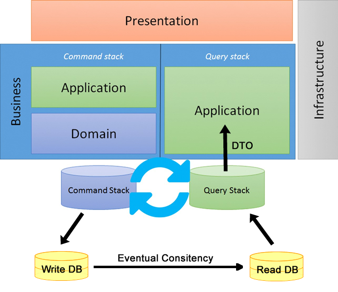

# CQRS and DDD sample using PHP 

This is a **very straight forward** implementation sample using 
Domain-Driven Design (DDD) + Command Query Responsibility Segregation (CQRS) principles.
 
The goal is to understand these terminologies, not to use cutting edge frameworks or technologies.

I kept the code as simple as possible. It is totally framework independent and its intent is to 
explain this approach. 

### Eventual consistency

Important thing about CQRS is that we deal with eventual consistency every time.

So probably your **view DB** will have consistent data, but it might not and your 
application must handle it. 



## Command & Query separation

Basically as **rule of thumb**: "_A method MUST update the state of the subject OR 
return the subject, but NEVER do both_".

Accept the subject as an object or entity (i.e. Product, Customer, Stock, etc.). So 
if you need to update this object you create a **Command** which does not return the current state
of the subject. If you wish to know the state of the object, use a **Query** for this. 


## DDD and CQRS

1. Incoming user requests to UI.
2. Commands are created and feed CommandBus.
3. CommandBus calls handles which talk to Domain.
4. Domain produces events.
5. Events are stored and dispatched.
6. Projections are built to fast query.


## DDD + CQRS terms:

The main terms used here are technically (and VERY shortly) explained above: 

- **Aggregate Root:**
  - Private constructor.
  - Generally it is an entity, like "User", "Product".
 
- **Entity:**
  - It has a lifecycle.
  - Can have its properties changed.

- **Value Object:**
  - Cannot be changed.
  - Only methods to retrieve information.

- **Domain Event:**
  - Generally triggered by an AggregateRoot.
  - They follow a timeline sequence.
  - There must be possible to revert (backtrack) the event.
 
- **Repository:**
  - Responsible to store and retrieve Entities from storage layer.
  - Persistence layer implementation cannot be exposed.
  
- **Services:**
  - Interacts with factories, repositories and entities to perform domain tasks.
  - Ideally should contain few (or better, just one) methods.
  - Follow Single Responsibility principle.
  
- **Command:**
  - Perform the write persistence tasks.
  - Command must not return any value, they are stateless.

- **Command Handler:**
  - Receives command and perform actions with its payload. 
  
- **Query:**
  - Perform the read persistence tasks.
  - After you excute a command, you can use a query to watch its result.

- **Query Handler**
  - Use repositories, webservices or any other storage layer to query the entities.
    
- **Event Publisher:**
  - Publish all aggregate root events.
  
- **Projector**
  - Handles the events and store relevant information to support application query.
  - They are generally used to increase Query speed, by preparing information before store.
  
# Installation

Run docker-compose:

```
docker-compose up -d
```

Install composer:

```
docker container exec -it cqrs_ddd_php_app composer install
```

Create database schema:

_Before executing the command above you must create a database `cqrs_ddd_php` in your Postgres server Docker container_.

```
docker container exec -it cqrs_ddd_php_app bin/doctrine orm:schema-tool:create
```

## Access EventStore

Access local EventStore web interface [here](http://localhost:2113).

- **User**: admin
- **Pass**: changeit

### Initialize EventStore

```
docker container exec -it cqrs_ddd_php_app bin/eventstore-setup
```

#### Projections options

Here you can find interesting links on how to work with projections:

- https://eventstore.org/docs/getting-started/projections/index.html
- https://eventstore.org/docs/projections/user-defined-projections/index.html


## Access RabbiMQ

Access local RabbitMQ management plugin [here](http://localhost:15672).

### Consuming commands

Execute the command above to start consuming published commands:

```
docker container exec -it cqrs_ddd_php_app bin/command-consumer
```
